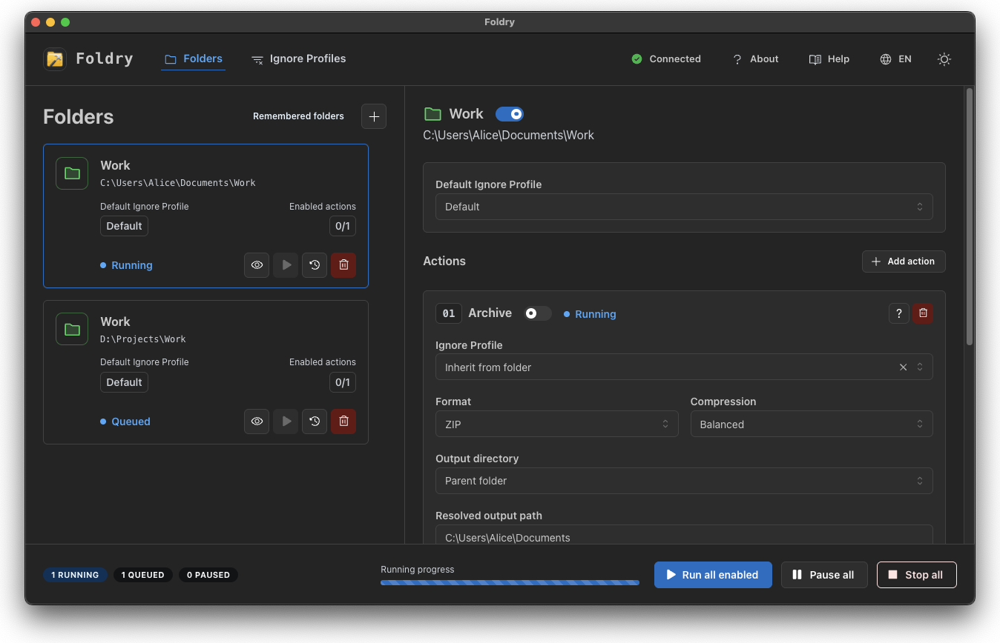
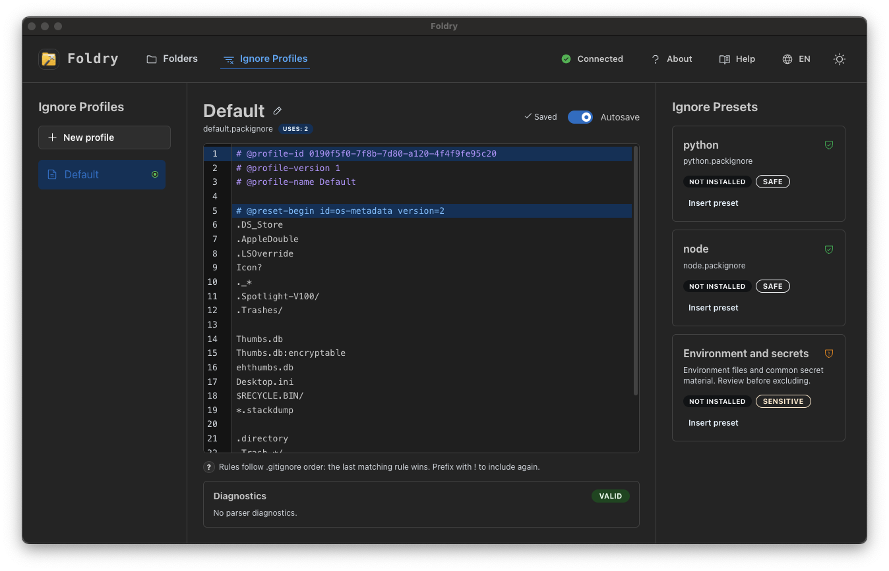
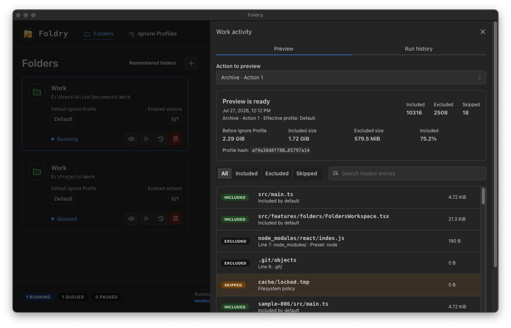

<p align="center">
  
</p>

<h1 align="center">Foldry</h1>

<p align="center">
  Prepare folders for safe, repeatable transfer or backup without sending them
  through a cloud service.
</p>

<p align="center">
  <a href="https://github.com/tychh/foldry/actions/workflows/ci.yml"></a>
  <a href="LICENSE-MIT"></a>
  
</p>

Foldry is a local-first desktop application for processing folders with reusable
Ignore Profiles. It is useful when a repository, project, or personal folder must
be moved with files that do not belong in Git or a public cloud, while generated
output and operating-system clutter should stay behind.

Version 0.1.2 focuses on verified local archives. Network synchronization is not
part of this release.

## Why Foldry

- **Folders are the primary objects.** Add a folder once, choose its default
  Ignore Profile, and attach independent actions.
- **Filtering is explicit.** Preview shows what will be included or excluded and
  which rule made the decision.
- **Archives are published safely.** Foldry writes a temporary file, verifies it,
  and only then replaces or publishes the destination.
- **Runs are observable.** The desktop application shows the queue, progress,
  warnings, history, logs, and immutable repeat snapshots.
- **Your data stays local.** Foldry has no telemetry, cloud client, account system,
  or remote crash upload.

## Screenshots

### Folders and actions

Manage remembered folders, configure Archive actions, choose Ignore Profiles,
preview results, and control queued runs from one workspace.



### Ignore Profiles

Edit `.packignore` rules with diagnostics and reusable presets. Profiles can be
shared by many folders while individual actions may override the folder default.



### Preview and history

Inspect included and excluded entries before a run, then review persisted results,
warnings, logs, and immutable snapshots.



## Install

Download the package for your platform from
[GitHub Releases](https://github.com/tychh/foldry/releases):

- Windows x64: NSIS installer or MSI;
- macOS Intel or Apple Silicon: architecture-specific DMG;
- Linux x64: AppImage or Debian package.

Release candidates may initially be unsigned. Read the release notes and your
operating system's warning before installing. See
[Platform support](docs/platform-support.md) for the current build and validation
matrix.

To build Foldry yourself, follow the
[Getting started guide](docs/getting-started.md).

## First use

1. Open **Add folders** and choose a source folder.
2. Keep the minimal **Default** Ignore Profile or select another profile.
3. Configure the Archive action: output, name, format, compression, and
   verification.
4. Open **Preview** and review the included and excluded entries.
5. Run the action. The final archive appears only after writing and verification
   succeed.

Foldry supports ZIP, TAR.GZ, and TAR.ZST. ZIP is the broadest cross-platform
choice; TAR.GZ is widely supported on Unix-like systems; TAR.ZST is typically the
fastest and smallest but may require an external extractor.

## Documentation

| I want to…                      | Read                                                    |
| ------------------------------- | ------------------------------------------------------- |
| Install or build Foldry         | [Getting started](docs/getting-started.md)              |
| Understand the desktop workflow | [User guide](docs/user-guide.md)                        |
| Write filtering rules           | [Ignore Profiles](docs/ignore-profiles.md)              |
| Diagnose a problem              | [Troubleshooting](docs/troubleshooting.md)              |
| Check platform support          | [Platform support](docs/platform-support.md)            |
| Report a security issue         | [Security policy](SECURITY.md)                          |
| Understand the codebase         | [Development documentation](docs/development/README.md) |

The [documentation index](docs/README.md) contains the complete map.

## Feedback

Bug reports, usability feedback, and feature requests are welcome. Foldry is
currently maintained as a single-author project, so code contributions and pull
requests are not being accepted.

Please read the [feedback and contribution policy](CONTRIBUTING.md) before opening
an issue or investing time in an implementation. Security vulnerabilities should
be reported privately according to the [security policy](SECURITY.md).

## Development

The workspace uses Rust 1.97.1, Node.js 24.18.0, pnpm 11.17.0, React, Mantine,
Tauri 2, SQLite, and a layered Rust core. An internal CLI adapter is retained for
development and automated testing but is not distributed in version 0.1.2.

```bash
corepack enable
pnpm install --frozen-lockfile
pnpm check
pnpm desktop:dev
```

The [development documentation](docs/development/README.md) describes the
architecture, contracts, safety constraints, tests, and release process for
maintainers and people studying or adapting the code.

## Security and privacy

Foldry treats source trees, profile rules, persisted YAML/JSON, and webview input
as untrusted. It does not follow symlinks while scanning, rejects archive path
traversal, reserves output names atomically, and keeps an existing archive until a
replacement has been verified.

Foldry does not encrypt its local database. Another process running as the same
operating-system user remains inside the trust boundary. See the
[security model](docs/development/security.md) for details and reporting guidance.

## License

Foldry is available under your choice of the [MIT License](LICENSE-MIT) or the
[Apache License 2.0](LICENSE-APACHE).

Created and maintained by [tychh](https://github.com/tychh). If Foldry is useful
to you, support is welcome on [Ko-fi](https://ko-fi.com/tychh).
